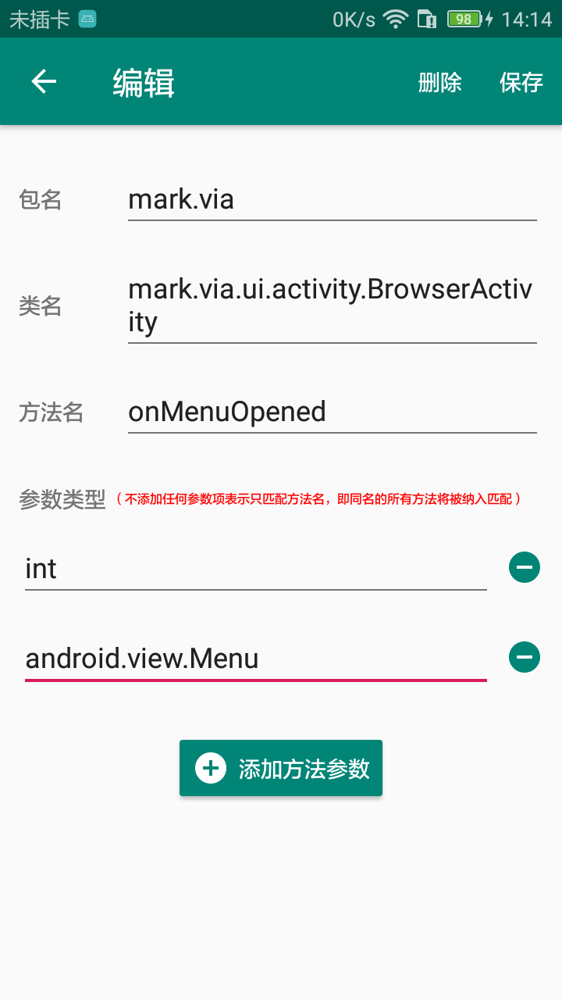
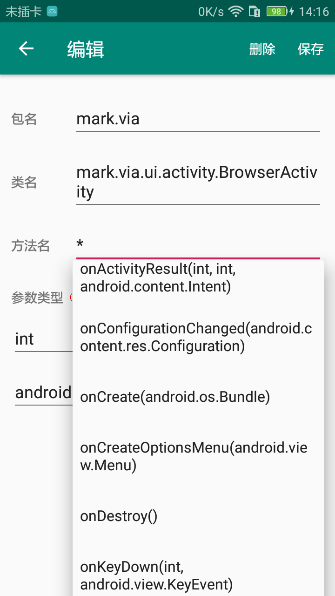

# XposedMethodTrack

## 简介
XposedMethodTrack是基于Xposed框架实现的方法（Method）跟踪应用。
有如下特点：
1. 能够实现对目标函数接口调用的监听。在监听到之后，通过logcat以及文件的方式，输出调用路径、参数设置
2. 提供方便易用的hook点配置界面

## 使用说明
1. 应用安装后，首先打开应用，进行初始配置。第一次进入需要进行权限授予。

2. 配置需要hook的方法，配置界面如下图所示：

点击右上角“+”可添加一个方法进行跟踪，即进入到编辑界面，如下图：

在编辑页，输入包名、类名时输入两个字符后可触发提示，方法名输入一个字符后可出现提示，同时当输入“*”时会提示类中的所有方法。如下图：

输入完成后点击保存回到主界面。

3. 在Xposed Installer中激活模块并重启。
重启后可以修改hook配置，并在**目标进程**重启后即可生效。

4. 在logcat中查看“**TrackLogger**”标签的log，
或者在“**/sdcard/MethodTrack/log/**”下查找被hook方法的调用信息。

